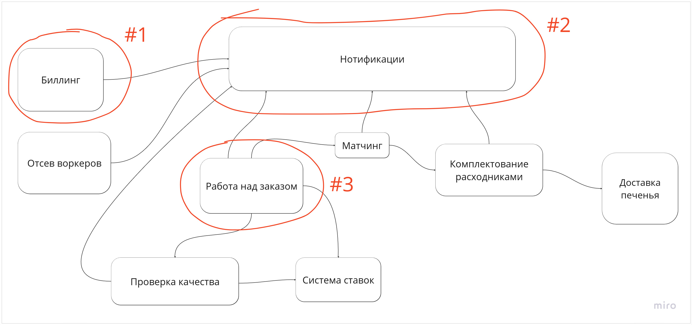
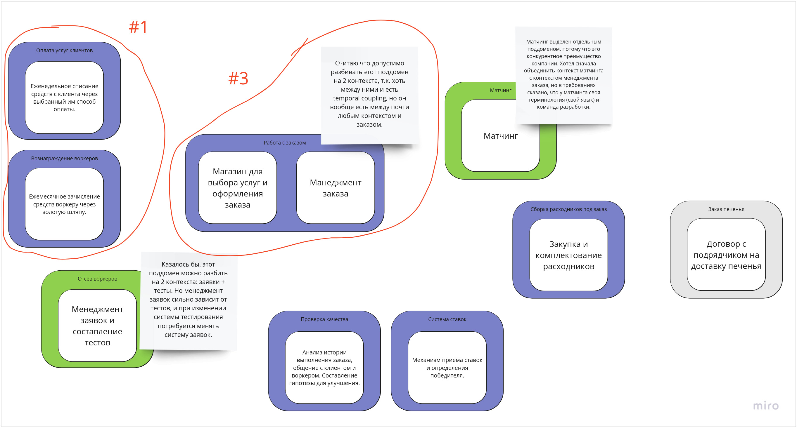

## Модель на основе bounded-контекстов

https://miro.com/app/board/uXjVMJekl-s=/?moveToWidget=3458764555024007379&cot=14

### Сравнение с контекстами ES-модели

Две модели в сравнении:

1. В ES-модели контекст биллинга был един, а в модели bounded-контекстов выделено 2 биллинговых контекста:
списания и зачисления. И даже на 2 поддомена, потому что они описывают разные проблемы бизнеса и могут иметь разные характеристики.
Как отмечено в уроке, списания и зачисления действительно имеют различия уже сейчас,
на этапе первых бизнес-требований:
   - клиенту должна предоставляться скидка, а воркеру должны начисляться штрафы;
   - клиент сам выбирает способ оплаты, а воркер получает деньги через золотую шляпу.

   **Почему они были объединены в 1 контекст в ES-модели**? Кажется просто потому, что показалось логичным
   сложить в одну группу все, что относится к биллингу. Т.е. это не ошибка ES-модели (из нее можно было увидеть,
   что между зачислениями и списаниями нет каплинга), а это моя ошибка проектирования в стиле "взгляд с точки зрения технической реализации".
2. В ES-модели был контекст нотификаций, но уже давно выяснили, что это техническая деталь
и ее не стоит отображать на диаграмме. В модели bounded-контекстов этого контекста нет.

   **Почему так получилось**? Потому что это моя ошибка в стиле "выделить технический шаг в отдельныйы бизнес-конеткст".
3. Работа с заказом в ES-модели была единым контекстом, а в модели bounded-контекстов распалась на 2:
   - магазин для оформления заказа;
   - логика менеджмента уже оформленного заказа.

    Обоснование заключается в том, что бизнес-задача предоставление услуги клиенту решается двумя шагами:
   - помочь клиенту выбрать нужную услугу, обеспечив его подробной информацией;
   - предоставить участникам процесса инструмент для сопровождения оформленного заказа.
   
   **Почему так получилось**? Потому что глядя только на ES-модель, не возникало мыслей, что магазин услуг и
   процесс оформления заказа -- это отдельная бизнес-задача. Зато это становится понятно,
если смотреть на ситуацию с точки зрения проблем бизнеса.