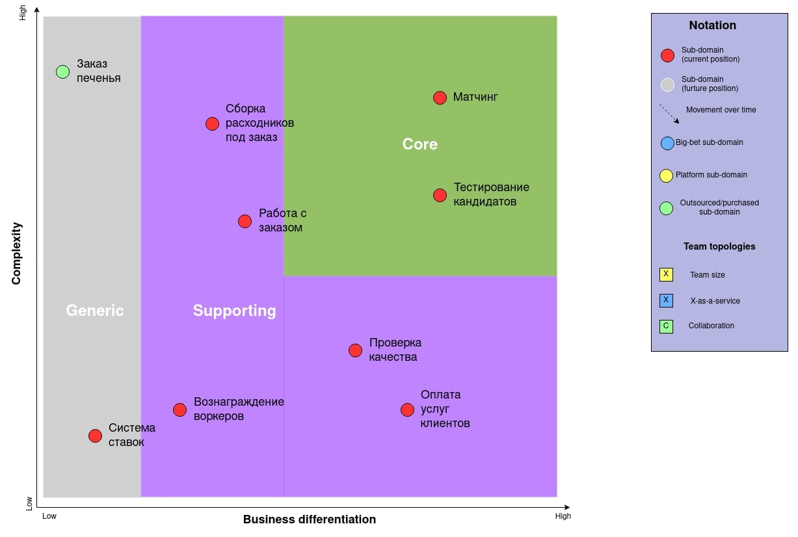

## Домен и поддомены

Основная цель компании MCF -- увеличивать продуктивность котов в их основной деятельности засчет освобождения их от рутинной работы.
Для выполнения повседневных рутинных дел котов-клиентов компания подбирает лучших представителей кошачьей породы,
благодаря чему у клиентов остается больше времени и сил на основную деятельность.

### Поддомены

| index | Поддомен                                           | Тип поддомена  |
|-------|----------------------------------------------------|----------------|
| 1     | Работа с заказом                                   | supporting     |
| 2     | Матчинг                                            | core           |
| 3     | Тестирование кандидатов в воркеры                  | core           |
| 4     | Сборка расходников под заказ                       | supporting     |
| 5     | Заказ печенья                                      | generic        |
| 6     | Проверка качества (гипотезы для улучшения бизнеса) | supporting     |
| 7     | Оплата услуг клиентов                              | supporting     |
| 8     | Вознаграждение воркеров                            | supporting     |
| 9     | Система ставок                                     | generic        |

### Core Domain Chart

