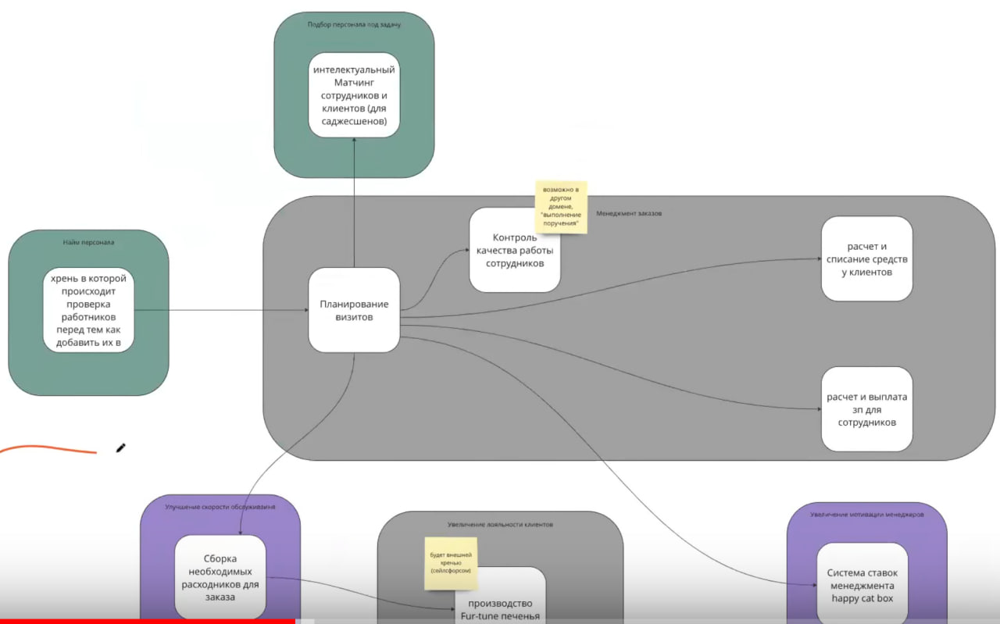

# Архитектурный стиль

Отталкивался от схемы бонудед-контекстов Антона, потому что моя схема из второй домашки сильно с ней разошлась.
Даже не стал перерисовывать ее, а просто заскринил со встречи-разбора:

## Характеристики и ограничения

### Ранее найденные характеристики
[Характеристики, найденные во второй домашке](../2_iteration/3.%20architecture-characteristics.md).
Тут только изменил требуемое значение scalability на более высокое,
потому что к третьей домашке от менеджеров поступила новая инфа об ожидаемой нагрузке (10 заказов в минуту),
а компания планирует расширяться на других котов.

| Характеристика | Значение                                                                                                           |
|----------------|--------------------------------------------------------------------------------------------------------------------|
| Availability   | Высокий (важно чтобы система не отказала из-за ддоса)                                                              |
| Scalability    | Высокая (может выдержать +250% от ожидаемой нагрузки)                                                              |
| Modifiability  | Требуется низкий каплинг                                                                                           |
| Securability   | Достаточно базовой системы ролей. Возможно менеджерам для доступа к денежным переводам потребуется отдельное право |
| Agility        | Система должна быть очень гибкой                                                                                   |
| Testability    | Высокий                                                                                                            |
| Deployability  | Высокий                                                                                                            |
| Usability      | Минимум обращений в тех поддержку от котов-клиентов                                                                |
| Cost           | Не важно                                                                                                           |

### Характеристики по новым данным из 3 домашки

- Очень высокие Agility, Testability, Deployability для системы отсева (недельнцый релизный цикл).
Средние значение для остальной части системы (релизный цикл - 1 месяц).
- Высокий fault tolerance из-за сильной нагрузки на систему менеджмента заказов (10 заказов в минуту).
- Высокая степень безопасности финансовых данных (Securability), а также дешевый и простой Modifiability для систем биллинга.

### Ограничения

- Данные должны храниться особым безопасным образом как того требуют надзорные органы.
- Денег хватит на все.

## Выбор архитектурного стиля

Самые важные характеристики для всей системы -- Agility, Testability, Deployability (как и в уроке).
Потому что они нужны для всех контекстов, и компания находится на этапе проверки гипотез.

**Поэтому выбираем между микросервисами и service-based**.

### Набор сервисов

1. Отсев воркеров. Требуется высокие fault tolerance, Agility, Testability, Deployability.
У него отличается релизный цикл от всей остальной системы,
а также нельзя допускать краша всей системы из-за ддоса.
Поэтому это отдельный сервис со своей реляционной базой.
2. Матчинг. Требуется высокий Agility, Availability и Maintainability.
Но уже реализован алгоритм и для его поддержки существует отдельная команда.
Поэтому выделяем в отдельный сервис. База -- реляционная.
3. Биллинг для списания средств с клиентов. Отдельный сервис со своей реляционной базой,
потому что важна консистентность и надежность данных.
4. Биллинг для зачислений -- тоже отдельный сервис со своей rdb. Все аналогично предыдущему пункту.
5. Система ставок. Отдельный сервис со своей rdb, потому что не требуется ничего сверхъестественного, и сервис не критичен.
Предполагается, что он не будет сильно меняться, а значит нет смысла подвергать его рискам появления регрессионных багов от изменения других частей системы.
6. Сборка расходников и заказ печений. Два боундед контекста объединены в один сервис. Есть своя rdb, потому что все просто.
7. Контроль качества. Отдельный сервис со своей базой, потому что имеет смысл отделить его от менеджмента заказов.
8. Менеджмент заказов. Отдельный сервис со своей базой.
Сервис будет подвержен высокой нагрузке, ему нужны высокие показатели Scalability, Agility, Testability, Deployability, Usability, Modifiability.
9. Сервис пользователей. Добавил, потому что требуется особо хранить персональные данные пользователей,
а отдельный сервис сможет изолировать их от всех остальных сервисов и контролировать их изменяемость.

### Итоговый выбор архитектуры
Микросервисы, потому что делим все на сервисы с отдельными базами.
