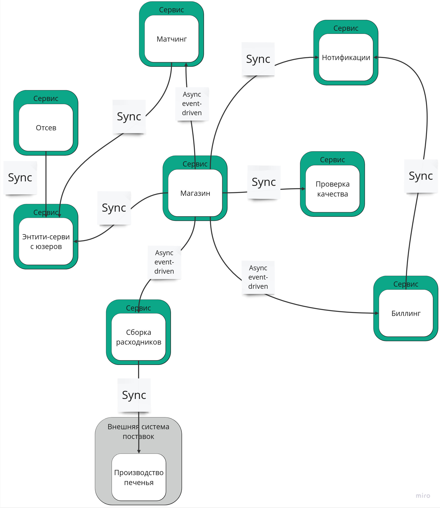
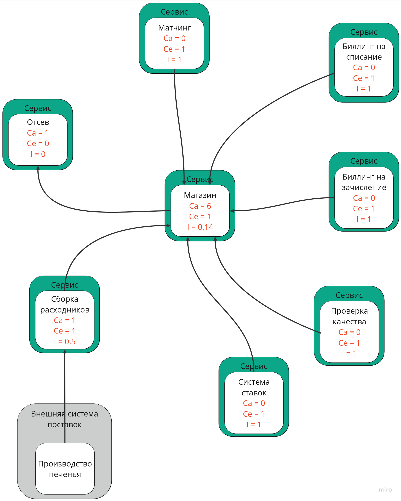

# Четвертая домашка

## Система нулевой домашки
При моделировании системы в нулевой домашке я не использовал терминологию курса (потому что ее не знал),
поэтому перерисовал схему в терминах курса, и теперь она выглядит так:

## Система третьей домашки
После третьей домашки я провел небольшую работу над ошибками, и итоговая система выглядит так:

## Расчет Instability

Чтобы рассчитать инстабилити сервисов, надо нарисовать диаграмму из зависимостей друг от друга.
Тут направление стрелки показывает, что сервис, из которого выходит стрелка, зависит от сервиса, в который стрелка входит.

1. Отсев воркеров:
Ca = 1;
Ce = 0;
I = 0;
2. Матчинг
Ca = 0;
Ce = 1;
I = 1;
3. Биллинг для списаний
Ca = 0;
Ce = 1;
I = 1;
4. Биллинг для зачислений
Ca = 0;
Ce = 1;
I = 1;
5. Система ставок
Ca = 0;
Ce = 1;
I = 1;
6. Сервис расходников
Ca = 1;
Ce = 1;
I = 0.5;
7. Контроль качества
Ca = 0;
Ce = 1;
I = 1;
8. Менджмент заказов
Ca = 6;
Ce = 1;
I = 0.14;

## Миграция системы нулевой домашки на систему из третьей домашки

Предполагаем, что у нас есть ресурсы, но нет опыта.
Тогда надо проделать такие шаги в следующей последовательности:
1. Добавить новый функционал ставок (не был добавлен в нулевой домашке).
2. Удалить сервис нотификаций, вынеся функционал отправки нотификаций в технические шаги сервисов магазина и биллинга.
3. Удалить entity-сервис пользователей. В нулевой домашке с ним работают аж 3 сервиса.
В итоге коммуникация от сервиса отсева пойдет в магазин.
4. Синхронную коммуникацию (request-response) между сервисами отсева и магазина заменить на асинхронную (event-driven).
5. Синхронную коммуникацию (request-response) между сервисами качества и магазина заменить на асинхронную (event-driven).
6. Асинхронную коммуникацию (event-driven) между магазином и матчингом заменить на синхронную (request-response).
7. Боундед-контекст биллинга распилить на два: биллинг для списаний и биллинг для зачислений.
Для этого потребуется использовать подход `Data first: Change Data Capture`,
потому что потребуется разносить данные о платежах в разные базы, и изменится схема их хранения в каждом из сервисов.